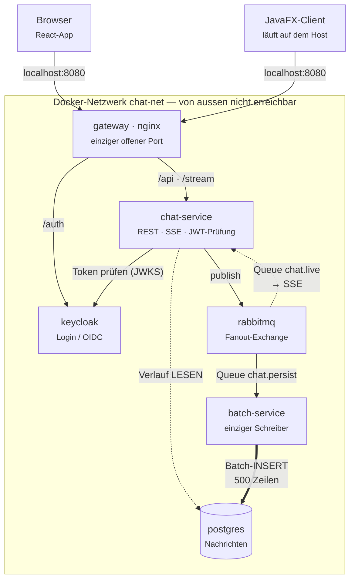
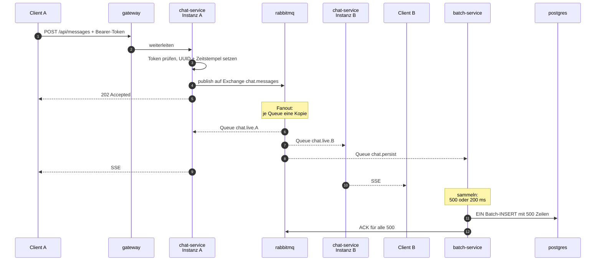
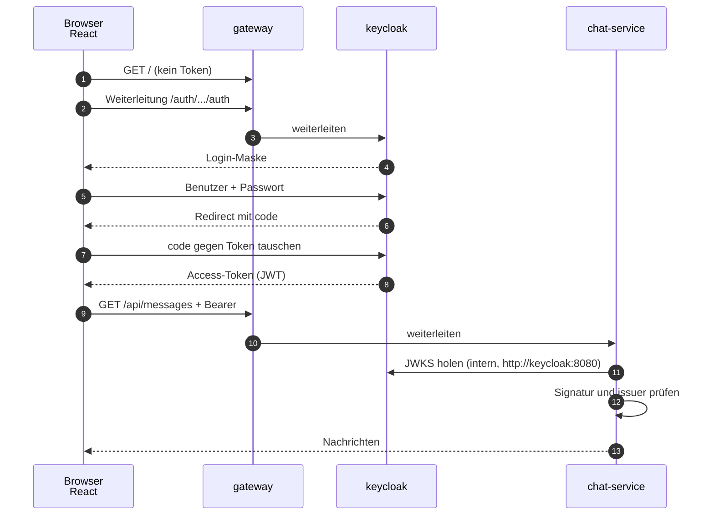

# Chat-App — Planung

Modul M321 (Verteilte Systeme / Microservices), Klasse IT3b.
Grundlage: die Skizze `docs/skizze-architektur.heic` (Stack + Blockdiagramm), erweitert um die Vorgaben
Keycloak, docker-compose, internes Docker-Netzwerk.

> **Stand der Umsetzung (18.09.2026):** Der bisher gebaute Code weicht an drei Stellen von dieser
> Planung ab: **Redis Pub/Sub** statt RabbitMQ, **WebSocket** statt SSE und eine **Web-UI in
> reinem HTML/JavaScript** statt React. Ob der Code an die Planung angepasst oder die Planung
> nachgeführt wird, ist noch offen.

---

## 1. Stack

| Bereich | Entscheidung | Warum |
|---|---|---|
| Sprache | **Java 21** | Vorgabe aus der Skizze |
| Backend-Framework | **Spring Boot 3.x** | Bringt REST, SSE, AMQP, OAuth2-Resource-Server und JPA mit, ohne Fremdbibliotheken |
| Web-UI | **React** (eigenes UI-Modul), Nachrichten per **SSE** | Eigenständig deploybarer Service — passt zum Modulthema Microservices |
| Desktop-UI | **JavaFX-Client** | Zweiter Client gegen dieselbe API, zeigt Client-Unabhängigkeit des Backends |
| Login | **Keycloak** (OIDC) | Vorgabe |
| Message Queue | **RabbitMQ** | Queues sichtbar in der Management-UI, Lehrplan-Vokabular, wenig Code |
| Datenbank | **PostgreSQL** | Standard, gut dokumentiert. Schreibzugriff ausschliesslich gebündelt über den `batch-service` *(änderbar)* |
| Einstiegspunkt | **nginx** als Reverse Proxy | Einziger nach aussen offener Port |
| Betrieb | **docker-compose**, ein internes Netzwerk `chat-net` | Vorgabe |

## 2. Architektur



> Grafisch aufbereitete Fassung dieser Diagramme:
> [`docs/design/2026-08-28-chat-app-architektur.html`](docs/design/2026-08-28-chat-app-architektur.html)
> (lokal im Browser öffnen).

Alles unterhalb des Gateways liegt **ausschliesslich** im Docker-Netz `chat-net`.
Keiner dieser Container veröffentlicht einen Port auf den Host.

### 2.1 Die drei Services

**gateway (nginx)** — einziger offener Port `8080`.
Liefert das React-Bundle aus und leitet weiter:

| Pfad | Ziel im Docker-Netz |
|---|---|
| `/` | statisches React-Bundle |
| `/api/…` | `chat-service:8080` |
| `/stream` | `chat-service:8080` (SSE) |
| `/auth/…` | `keycloak:8080` |

**chat-service** — das Backend aus der Skizze. Aufgaben:
- REST-Endpunkt `POST /api/messages` — Nachricht entgegennehmen und **nur** auf den
  RabbitMQ-Exchange publizieren. Es schreibt selbst **nicht** in die Datenbank.
- `GET /api/messages?roomId=…` — Verlauf der letzten N Nachrichten aus der Datenbank **lesen**.
- `GET /stream` — SSE-Verbindung. Der Service hört per `@RabbitListener` auf seiner Live-Queue
  und schiebt jede eintreffende Nachricht in alle offenen SSE-Verbindungen.
- **Raumverwaltung** — `POST /api/rooms` legt einen Raum an, `POST /api/rooms/{id}/members`
  lädt jemanden per Benutzernamen ein, `GET /api/rooms` listet die eigenen Räume.
  Diese drei schreiben **direkt** in die Datenbank, ohne Queue und ohne Bündeln (Abschnitt 2.4).
- Prüft bei jedem Aufruf das JWT von Keycloak (OAuth2 Resource Server).

**batch-service** — läuft ohne Web-Oberfläche und **genau einmal** (eine Instanz). Er ist der
**einzige Dienst, der in die Nachrichtentabelle schreibt**:
- Liest fortlaufend aus der Queue `chat.persist` und schreibt **gebündelt** in die Datenbank
  (Details in Abschnitt 2.3). Das ist seine Hauptaufgabe.
- Zusätzlich zeitgesteuert (`@Scheduled`): Nachrichten älter als 30 Tage archivieren bzw. löschen,
  nächtliche Statistik (Nachrichten pro Raum, aktive Nutzer) in eine Tabelle schreiben.
- Meldet das Statistik-Ergebnis an RabbitMQ, damit es im Chat als Systemmeldung erscheinen kann.

### 2.2 Nachrichtenfluss (der wichtigste Ablauf im Modul)

1. Der Client sendet `POST /api/messages` mit Bearer-Token an das Gateway.
2. Das Gateway leitet an `chat-service` weiter.
3. `chat-service` prüft das Token, vergibt eine UUID und einen Zeitstempel — und publiziert
   die Nachricht auf den **Fanout-Exchange** `chat.messages`. Danach antwortet es dem Client.
   **Keine Datenbank im Anfrageweg.**
4. Am Exchange hängen zwei Arten von Queues:
   - `chat.live.<instanz>` — eine pro `chat-service`-Instanz, flüchtig. Für die Anzeige.
   - `chat.persist` — eine einzige, dauerhafte Queue. Für das Speichern.
5. Jede `chat-service`-Instanz schiebt ihre Kopie sofort über SSE an ihre Clients.
6. Der `batch-service` sammelt seine Kopien und schreibt sie gebündelt in PostgreSQL.

Schritt 4 ist der Grund für die Queue — gleich zweifach:
**Verteilung** (bei zwei Backend-Instanzen sieht ein Nutzer an Instanz A auch Nachrichten von
Instanz B) und **Entkopplung** (die Anzeige wartet nicht auf die Datenbank).



### 2.3 Schreibpfad: warum gebündelt statt einzeln

**Das Problem.** Bei 100 000 Nachrichten pro Sekunde wären das 100 000 einzelne
`INSERT`-Anweisungen pro Sekunde. Jede davon kostet einen Netzwerk-Roundtrip zur Datenbank,
einen Parse-Vorgang und einen eigenen Transaktions-Commit. Die Datenbank ist damit lange vor
der Anwendung am Anschlag — und der Nutzer wartet beim Senden mit.

**Die Lösung.** Der `batch-service` sammelt, was aus `chat.persist` hereinkommt, und schreibt
in Paketen:

| Regel | Wert | Warum |
|---|---|---|
| Paketgrösse | 500 Nachrichten | Ein `INSERT` mit 500 Zeilen statt 500 Anweisungen |
| Zeitlimit | 200 ms | Damit auch bei wenig Betrieb nichts liegen bleibt |
| Ausgelöst durch | **was zuerst eintritt** | Voll oder Zeit abgelaufen — dann wird geschrieben |

Rechenbeispiel für die Klasse: 100 000 ÷ 500 = **200 Schreibvorgänge pro Sekunde** statt
100 000. Das ist Faktor 500 weniger Roundtrips, bei identischer Datenmenge.

**Wie das konkret gebaut wird:**
- Spring AMQP kann Consumer-seitig bündeln: `setConsumerBatchEnabled(true)`,
  `setBatchSize(500)`, `setReceiveTimeout(200)`. Die Listener-Methode bekommt dann eine
  `List<Message>` statt einer einzelnen Nachricht — genau die Semantik «500 Stück oder 200 ms».
- Geschrieben wird mit `JdbcTemplate.batchUpdate(...)`. In der JDBC-URL muss
  `reWriteBatchedInserts=true` stehen, sonst schickt der PostgreSQL-Treiber die Zeilen trotzdem
  einzeln über die Leitung.
- **Prefetch ≥ Paketgrösse.** Steht `prefetch` auf 250, kann der Consumer nie 500 Nachrichten
  sammeln und läuft dauernd ins Zeitlimit. Ein klassischer Anfängerfehler.

**Was dabei schiefgehen kann — und die Antwort darauf:**

| Risiko | Antwort |
|---|---|
| Absturz mitten im Paket → Nachrichten weg | **ACK erst nach dem Commit** der Datenbank-Transaktion. Ohne ACK stellt RabbitMQ das ganze Paket erneut zu. |
| Erneute Zustellung → Nachricht doppelt in der DB | Die UUID kommt vom `chat-service` und ist der Primärschlüssel. `ON CONFLICT (id) DO NOTHING` verwirft die Dublette. |
| Reihenfolge | Der Zeitstempel wird im `chat-service` gesetzt, nicht von der Datenbank. Damit stimmt die Reihenfolge auch bei mehreren Schreibern. |
| Datenbank kommt nicht nach | Die Queue `chat.persist` wächst — **sichtbar** in der RabbitMQ-Management-UI. Genau das ist die Lehrstunde zu Backpressure. |

**Der Preis, ehrlich benannt.** Eine gesendete Nachricht steht bis zu 200 ms später in der
Datenbank. Für die Anzeige spielt das keine Rolle — der SSE-Weg läuft völlig unabhängig und
ist sofort da. Nur wer in genau diesem Moment den Verlauf neu lädt, sieht die letzten
Millisekunden noch nicht. Das ist bewusst akzeptiert.

**Und die ehrliche Einordnung zur Zahl 100 000/s:** bei dieser Last wäre nicht mehr die
Datenbank der Engpass, sondern der Broker und das Verteilen an die SSE-Verbindungen. Das
Bündeln löst genau ein Problem — das der Schreiblast. Es macht die App nicht automatisch
skalierbar.


### 2.4 Rückstau: was passiert, wenn der Schreiber nicht nachkommt

Der `batch-service` läuft **einmal**. Eine Instanz ist damit die Obergrenze für den Durchsatz —
schafft sie 200 Pakete pro Sekunde, ist bei 100 000 Nachrichten pro Sekunde Schluss. Wird mehr
gesendet als geschrieben, wächst die Queue `chat.persist`. Das ist kein Fehler, das ist die
Aufgabe einer Queue. Drei Fälle muss man aber auseinanderhalten:

| Fall | Was passiert | Was wir tun |
|---|---|---|
| **Kurzer Rückstau** — eine Lastspitze | Queue wächst und leert sich wieder | Nichts. Genau dafür ist die Queue da. |
| **Dauerhafter Rückstau** — Datenbank langsam oder weg | Queue wächst, bis der Speicher des Brokers voll ist | RabbitMQ bremst von sich aus die Absender aus (*Flow Control*): der `publish` im `chat-service` blockiert. Nach einem Zeitlimit antwortet `POST /api/messages` mit `503`. Der Chat nimmt sichtbar nichts mehr an. |
| **Giftnachricht** — eine einzelne Nachricht lässt sich nie schreiben | Kein ACK, RabbitMQ stellt endlos erneut zu, die Queue kommt nie leer | Quorum-Queue mit `x-delivery-limit: 3`. Nach drei Versuchen wandert die Nachricht in die Dead-Letter-Queue `chat.persist.dlq` und kann dort angeschaut werden. |

**Bewusst nicht gewählt: `x-max-length` mit «ältestes wegwerfen» auf `chat.persist`.** Das
begrenzt zwar den Speicher, löscht dafür aber still Nachrichten aus dem Verlauf — und niemand
merkt es. Ein Chat, der sichtbar keine neuen Nachrichten mehr annimmt, ist besser als einer,
dessen Verlauf lautlos Löcher bekommt.

**Der interessante Punkt: dieselbe Nachricht, zwei Queues, gegensätzliche Regeln.**

| Queue | Wofür | Bei Überlauf |
|---|---|---|
| `chat.persist` | den Verlauf **speichern** | **Nichts wegwerfen.** Lieber blockieren. Dauerhaft (`durable`), Quorum-Queue, DLQ für Giftnachrichten. |
| `chat.live.<instanz>` | jetzt **anzeigen** | **Wegwerfen ist richtig.** `x-max-length: 1000` (ältestes fliegt raus) und `x-message-ttl: 30000`. Eine 30 Sekunden alte «Live»-Nachricht ist wertlos — wer sie verpasst hat, holt sie mit `GET /api/messages` nach. |

Das ist die Lehrstunde dieses Abschnitts: Wie man mit Überlauf umgeht, hängt nicht an der
Nachricht, sondern daran, **wozu** man sie gerade braucht.

**Ein Haken, der zum Bündeln gehört.** Der Zähler `x-delivery-limit` zählt pro Nachricht — aber
schiefgehen kann nur das ganze Paket. Eine einzige kaputte Nachricht lässt alle 500 scheitern
und schickt am Ende alle 500 in die DLQ. Antwort darauf: schlägt ein Paket fehl, schreibt der
`batch-service` dieses eine Paket **einmalig Zeile für Zeile**. Dann scheitert nur die wirklich
kaputte Nachricht, die restlichen 499 sind gespeichert. Steht als offener Punkt drin.

### 2.5 Login-Ablauf (Keycloak)

1. React erkennt: kein gültiges Token vorhanden → leitet den Browser auf
   `localhost:8080/auth/realms/chat/protocol/openid-connect/auth` (Authorization Code + PKCE).
2. Nutzer meldet sich bei Keycloak an, Keycloak leitet mit `code` zurück zur React-App.
3. React tauscht den `code` gegen ein Access-Token.
4. Jeder API-Aufruf trägt `Authorization: Bearer <token>`.
5. `chat-service` prüft die Signatur gegen den JWKS-Endpunkt von Keycloak — **intern** über
   `http://keycloak:8080`, ohne den Host zu berühren.

Der JavaFX-Client macht denselben Ablauf mit einem eingebetteten Browserfenster oder dem
Device-Authorization-Flow.




### 2.6 Docker-Compose — Ports und Netzwerk

```yaml
# Skizze, nicht die fertige Datei
services:
  gateway:       { ports: ["8080:80"], networks: [chat-net] }   # einziger offener Port
  chat-service:  { expose: ["8080"],   networks: [chat-net] }
  batch-service: {                     networks: [chat-net] }
  keycloak:      { expose: ["8080"],   networks: [chat-net] }
  rabbitmq:      { expose: ["5672"],   networks: [chat-net] }
  postgres:      { expose: ["5432"],   networks: [chat-net] }
networks:
  chat-net: { driver: bridge }
```

Merksatz für die Prüfung: `expose` macht einen Port **nur im Docker-Netz** sichtbar,
`ports` veröffentlicht ihn auf dem Host. Genau ein `ports`-Eintrag ist erlaubt.
Die Services erreichen einander über ihren **Service-Namen** als Hostname (`chat-service`,
`rabbitmq`, …) — das übernimmt Dockers interner DNS.

## 3. Datenmodell (Entwurf)

```
room
  id          UUID        PK
  name        VARCHAR          Anzeigename, vom Ersteller vergeben
  created_by  VARCHAR          Benutzername des Erstellers
  created_at  TIMESTAMPTZ

room_member
  room_id     UUID        PK   zusammengesetzter Schlüssel aus beiden Spalten,
  username    VARCHAR     PK   damit dieselbe Person nicht doppelt drinsteht
  invited_by  VARCHAR          wer eingeladen hat
  joined_at   TIMESTAMPTZ

message
  id          UUID        PK   -- kommt vom chat-service, NICHT von der Datenbank
  room_id     UUID        FK   -> room.id
  sender      VARCHAR          Benutzername aus dem Token ("preferred_username")
  text        TEXT
  sent_at     TIMESTAMPTZ      vom chat-service gesetzt, nicht per DEFAULT now()
```

**Räume und Mitglieder** (entschieden nach der ersten Fassung): Wer einen Raum anlegt, ist
sofort Mitglied. Jedes Mitglied darf weitere Personen **per Benutzername** einladen; wer
eingeladen wird, ist damit sofort Mitglied — es gibt keine Einladung zum Annehmen. Das ist die
einfachste Regel, die funktioniert, und sie lässt sich später um einen Status erweitern.

Bei `POST /api/messages` und `GET /api/messages` prüft der `chat-service` mit **einer** Abfrage
auf `room_member`, ob der Benutzername aus dem Token in diesem Raum überhaupt Mitglied ist.
Genau dafür liegt die Mitgliedertabelle bei uns und nicht in Keycloak: Keycloak weiss, **wer**
jemand ist — nicht, **wo** er mitlesen darf.

Zwei Details hängen direkt am Bündeln aus Abschnitt 2.3:

- **Die UUID vergibt der `chat-service`**, bevor er publiziert. Nur so kann der Schreibvorgang
  gefahrlos wiederholt werden: `INSERT … ON CONFLICT (id) DO NOTHING` verwirft eine erneut
  zugestellte Nachricht. Eine von der Datenbank vergebene ID (`SERIAL`) würde bei jedem
  Wiederholungsversuch eine neue Zeile erzeugen — die Nachricht stünde doppelt im Chat.
- **Den Zeitstempel setzt ebenfalls der `chat-service`.** Ein `DEFAULT now()` in der Datenbank
  würde den Moment des Schreibens festhalten, nicht den des Sendens — bei einem Paket von 500
  Nachrichten hätten alle exakt dieselbe Zeit.

Benutzer werden **nicht** in der eigenen Datenbank gehalten — dafür ist Keycloak zuständig.
Gespeichert wird nur der Benutzername als Absender.

## 4. Offene Punkte

1. **Keycloak-Issuer hinter dem Proxy.** Der Browser sieht Keycloak als
   `localhost:8080/auth`, `chat-service` intern als `keycloak:8080`. Stimmen die Werte nicht
   überein, passt das `iss`-Feld im Token nicht zur erwarteten Issuer-URL und die Prüfung
   schlägt fehl. Lösung: `KC_HOSTNAME` auf die öffentliche URL setzen. **Muss getestet werden.**
2. **SSE und der Authorization-Header.** Das native `EventSource` im Browser kann **keine**
   eigenen Header senden. Varianten: Token als Query-Parameter (unschön, landet im Log),
   ein kurzlebiges Ticket vor dem Verbindungsaufbau, oder `fetch`-basiertes SSE. Zu entscheiden.
3. **Paketgrösse und Zeitlimit sind geraten.** 500 Nachrichten / 200 ms sind Startwerte, keine
   gemessenen. Sie müssen unter Last nachgestellt werden — das ist eine schöne Messübung:
   Queue-Länge und Schreibdauer gegeneinander auftragen.
4. **Einzelweg nach einem fehlgeschlagenen Paket** (Abschnitt 2.4). Schlägt ein Paket fehl,
   soll der `batch-service` es einmalig Zeile für Zeile schreiben, damit nur die tatsächlich
   kaputte Nachricht in der DLQ landet. Noch nicht gebaut.
5. **Existiert der eingeladene Benutzername überhaupt?** Beim Einladen prüfen wir vorerst
   **nicht** gegen Keycloak. Ein Tippfehler legt dann eine Mitgliedschaft für jemanden an, den
   es nicht gibt — harmlos, aber unschön. Später über die Keycloak-Admin-API prüfbar.
6. **RabbitMQ Management-UI im Unterricht.** Sie liegt auf Port 15672 und wäre laut Vorgabe
   nicht erreichbar. Entweder über das Gateway unter `/rabbit` proxien oder für Demos
   bewusst freigeben.
7. **Zweite chat-service-Instanz** (gestrichelter Kasten in der Skizze) — geplant, aber noch
   nicht entschieden, ob sie Teil der Abgabe ist. Jede Instanz braucht eine eigene,
   exklusive Queue am Fanout-Exchange.
8. **Nachrichtenverlust beim Reconnect.** Fällt die SSE-Verbindung kurz aus, fehlen Nachrichten.
   Geplant: nach dem Reconnect den Verlauf per `GET /api/messages` nachladen.
9. **JavaFX-Client und Docker.** Der Client läuft auf dem Host, nicht im Compose. Er nutzt
   `localhost:8080` wie der Browser — die Port-Regel bleibt damit eingehalten.
10. **Raum verlassen, Mitglied entfernen, Raum löschen** — geplant ist bisher nur anlegen und
   einladen. Was mit den Nachrichten passiert, wenn ein Raum gelöscht wird, ist offen.
11. **Rollen in Keycloak** (z. B. `user`, `moderator`) — noch nicht festgelegt. Eine Rolle
   `moderator` wäre die naheliegende Stelle, um das Einladen einzuschränken.

## 5. Nächste Schritte

1. `docker-compose.yml` mit Keycloak, RabbitMQ, PostgreSQL — hochfahren und prüfen, dass
   von aussen nur Port 8080 antwortet.
2. Keycloak-Realm `chat` mit einem Testnutzer anlegen und exportieren, damit der Realm beim
   Start automatisch importiert wird.
3. `chat-service`: `POST /api/messages` publiziert auf den Exchange, `GET /api/messages` liest
   aus der Datenbank. Noch ohne Consumer — die Nachricht landet erst mal nirgends.
4. `batch-service`: Consumer auf `chat.persist`, **zuerst einzeln schreiben**. Damit ist der Weg
   Ende zu Ende sichtbar und die Nachricht steht in der Datenbank.
5. Erst dann auf Bündeln umstellen (`setConsumerBatchEnabled`, `batchUpdate`) und den
   Unterschied messen. Diese Reihenfolge ist Absicht: man sieht, was das Bündeln bringt.
6. Raumverwaltung: Tabellen `room` und `room_member`, die drei Endpunkte, und die
   Mitgliedsprüfung beim Senden und Lesen.
7. SSE-Endpunkt und React-Oberfläche.
8. Queue-Regeln aus Abschnitt 2.4 setzen (Quorum-Queue, `x-delivery-limit`, DLQ; TTL und
   Längenbegrenzung auf den Live-Queues) und den Rückstau in der Management-UI provozieren.
9. Zeitgesteuerte Aufgaben im `batch-service` (Archivierung, Statistik).
10. JavaFX-Client.

---

## Verlauf

*Dieser Abschnitt ist von der KI (Claude) geschrieben und hält den Planungsweg fest.*

### Fragen, die ich gestellt habe

1. **Womit soll die Web-App gebaut werden?** — Ich hatte Thymeleaf + SSE empfohlen, weil es
   ohne npm auskommt und jede Zeile im Unterricht erklärbar ist.
2. **Welcher Message Broker?** — RabbitMQ, Kafka oder ActiveMQ Artemis.
3. **Wie fein soll geschnitten werden?** — 2, 3 oder 4–5 Services.
4. **Ist ein Desktop-Client im Scope?** — Ich hatte davon abgeraten.
5. **Nachfrage nach der Desktop-Antwort:** Wie lösen wir den Zugriff des JavaFX-Clients,
   ohne die Regel "nur die Web-App ist über Localhost erreichbar" zu brechen?

### Wo umentschieden wurde

- **Web-UI: mein Vorschlag wurde verworfen.** Ich hatte Thymeleaf empfohlen und dabei das
  Modulziel falsch gewichtet: M321 lehrt verteilte Systeme und Microservice-Architektur.
  Ein server-gerendertes Template im Backend hätte UI und Backend zusammengezogen — genau
  das Gegenteil der Lernaufgabe. Entschieden wurde **React als eigenes UI-Modul**, das
  separat deployt wird, plus SSE für die Live-Nachrichten. Das ist die richtige Entscheidung.
- **Desktop-Client: von "nein" auf "ja".** Ich hatte abgeraten, weil ein zweiter Client einen
  zweiten offenen Port zu brauchen scheint. Die Entscheidung fiel auf "ja" — und zwang mich
  zu einer besseren Lösung: ein Gateway als einziger Einstiegspunkt. Beide Clients nutzen
  denselben Port. Der Widerspruch, den ich als Ausschlussgrund gesehen hatte, war keiner.
- **RabbitMQ wurde nicht einfach akzeptiert**, sondern begründet nachgefragt. Die Begründung
  (sichtbare Queues in der Management-UI, Lehrplan-Vokabular Exchange/Queue/ACK, wenig Code,
  leichtgewichtig im Compose) hat gehalten. Gegenargument bleibt notiert: Kafka wäre
  industriell relevanter für Datenströme.

### Verworfene Varianten

| Verworfen | Grund |
|---|---|
| Thymeleaf + SSE als Web-UI | Zieht UI und Backend zusammen, widerspricht dem Modulziel |
| Vaadin Flow | Zu viel Framework-Magie, für Lernende nicht Zeile für Zeile erklärbar |
| Apache Kafka | Offsets/Partitionen sind ein anderes Kapitel; schwergewichtiger im Compose |
| ActiveMQ Artemis | Weniger verbreitet, keine gleichwertige sichtbare Oberfläche |
| 2 Services (Web + Backend zusammen) | Zeigt zu wenig verteilte Kommunikation |
| 4–5 Services (user-, notification-service) | Mehr Boilerplate pro Feature als Lernwert |
| Zweiter offener Port fürs Backend | Verletzt die Vorgabe direkt |
| Spring Cloud Gateway statt nginx | Ein weiterer Spring-Service mit eigener Konfiguration; nginx sind zehn Zeilen Config |
| Desktop-Client ganz weglassen | Als offener Punkt zu wenig — die Gateway-Lösung macht ihn ohne Regelbruch möglich |

### Was ich ohne Rückfrage entschieden habe

PostgreSQL als Datenbank, Spring Boot als Framework, Fanout-Exchange statt Direct-Exchange,
und die Aufgaben des batch-service. Alles vier ist ohne Umbau der Architektur austauschbar —
darum keine Frage, sondern eine Festlegung, die man überstimmen kann.

### Nachtrag — Diagramme

Die ASCII-Skizze im Abschnitt Architektur wurde durch **Mermaid**-Diagramme ersetzt (Container-
Übersicht, Nachrichtenfluss, Login). Mermaid rendert direkt in GitHub und IntelliJ, bleibt aber
als Text im Repo — man sieht im Diff, was sich geändert hat. Zusätzlich liegt eine grafisch
aufbereitete Fassung unter `docs/design/2026-08-28-chat-app-architektur.html`; die Datei ist
lokal und benötigt keine Internetverbindung, weil `mermaid.min.js` daneben liegt.

### Nachtrag — Schreiblast (Vorgabe kam nach der ersten Fassung)

In der ersten Fassung schrieb der `chat-service` jede Nachricht sofort selbst in die Datenbank
und publizierte sie erst danach. Die Vorgabe, auf 100 000 Nachrichten pro Sekunde zu denken,
hat diesen Weg gekippt: 100 000 einzelne `INSERT`-Anweisungen pro Sekunde sind kein
Datenbankproblem mehr, sondern ein Architekturfehler.

**Was sich geändert hat:** der `chat-service` schreibt gar nicht mehr. Er publiziert nur noch,
und der `batch-service` — bisher nur ein nächtlicher Aufräumdienst — ist zum einzigen Schreiber
geworden und bündelt (Abschnitt 2.3). Damit hat der Broker eine zweite Aufgabe bekommen: er
verteilt nicht nur, er entkoppelt auch die Anzeige von der Datenbank.

**Verworfen wurde dabei:**

| Verworfen | Grund |
|---|---|
| `chat-service` schreibt einzeln, `batch-service` räumt nur auf | Genau der Fall, den die Vorgabe ausschliesst |
| Sammelpuffer im `chat-service` selbst | Bei mehreren Instanzen schreiben mehrere Dienste gleichzeitig; ausserdem ist der Puffer bei einem Neustart weg, weil er nicht in der Queue steht |
| Nur nach Anzahl bündeln (ohne Zeitlimit) | Bei wenig Betrieb bleiben Nachrichten beliebig lange liegen |
| Nur nach Zeit bündeln (ohne Obergrenze) | Bei einem Lastspitze wird ein einzelnes Paket beliebig gross |
| ID und Zeitstempel von der Datenbank vergeben lassen | Macht das Wiederholen eines Pakets unmöglich und verfälscht die Sendezeit |

**Was ich dabei ohne Rückfrage festgelegt habe:** die Werte 500 Nachrichten und 200 ms. Beide
sind Startwerte und stehen als offener Punkt Nr. 3 zum Nachmessen drin.

**Was ich einordnen muss, auch wenn es nicht gefragt war:** bei echten 100 000 Nachrichten pro
Sekunde wäre der Engpass nicht mehr die Datenbank, sondern der Broker und das Verteilen an die
SSE-Verbindungen. Das Bündeln löst die Schreiblast — nicht die Skalierung insgesamt.

### Nachtrag — Rückstau, Räume und die Zahl der Schreiber

Drei offene Punkte wurden entschieden, zwei davon per Vorgabe, einer auf meinen Vorschlag hin.

**Vorgegeben:**

- **Der `batch-service` läuft vorerst genau einmal.** Damit ist die Frage nach Competing
  Consumers vom Tisch — und ehrlicherweise ist eine Instanz die saubere Reihenfolge zum Lernen:
  erst sehen, wo die Grenze einer Instanz liegt, dann über eine zweite reden.
- **Räume legt ein Nutzer selbst an und lädt per Benutzername ein.** Ich habe daraus die
  einfachste Form gemacht, die trägt: eingeladen heisst sofort Mitglied, kein Annehmen. Und
  zwei Tabellen statt einer, weil die Mitgliedschaft die Zugriffsprüfung ist.

**Auf Nachfrage vorgeschlagen — was bei einem Überlauf von `chat.persist` passieren soll:**
nichts wegwerfen, sondern blockieren. Die Begründung steht in Abschnitt 2.4; kurz: eine
Nachricht in `chat.persist` **ist** der Verlauf, und ein Verlauf mit stillen Löchern ist
schlimmer als ein Chat, der sichtbar streikt. Dazu eine Dead-Letter-Queue, aber ausdrücklich
nur für Nachrichten, die sich **nie** schreiben lassen — nicht für zu viele auf einmal. Diese
beiden Fälle werden regelmässig verwechselt.

Der Gewinn dabei war nicht die Entscheidung selbst, sondern der Vergleich: `chat.live` bekommt
die **gegenteilige** Regel (wegwerfen und nach 30 Sekunden verfallen lassen), obwohl dieselbe
Nachricht drinsteht. Das macht sichtbar, dass Überlaufverhalten am Zweck hängt, nicht an den
Daten.

**Verworfen:**

| Verworfen | Grund |
|---|---|
| `x-max-length` mit «ältestes wegwerfen» auf `chat.persist` | Löscht still Nachrichten aus dem Verlauf; niemand merkt es |
| Queue unbegrenzt laufen lassen und nur beobachten | Ohne Grenze fällt irgendwann der Broker aus — und mit ihm auch der Live-Chat |
| Einladung mit Annehmen/Ablehnen | Zwei Zustände mehr, für die Aufgabenstellung kein Gewinn |
| Mitgliedschaften als Keycloak-Gruppen | Bindet die Fachlogik an den Login-Dienst und braucht die Admin-API für jede Einladung |
| Raum als reines Textfeld an der Nachricht (erste Fassung) | Kein Ort für Mitglieder, keine Zugriffsprüfung möglich |

**Was ich dabei ohne Rückfrage festgelegt habe:** `x-delivery-limit: 3`, `x-max-length: 1000`
und 30 Sekunden TTL auf den Live-Queues. Startwerte wie 500/200 ms — gehören nachgemessen.

### Nachtrag — Sprache im Code

Der Code ist **englisch**, die Erklärung **deutsch**: Klassen, Methoden, Variablen, Tabellen- und
Spaltennamen, JSON-Felder und Query-Parameter auf Englisch; Kommentare, Log-Ausgaben,
Fehlermeldungen und alle Swagger-Beschreibungen auf Deutsch.

Die erste Fassung dieses Dokuments hatte deutsche Spaltennamen (`raum`, `absender`, `gesendet_am`)
und der erste Implementierungsplan entsprechend deutsche Bezeichner. Der Grund für den Wechsel:
Java, Spring und SQL bringen ihr eigenes englisches Vokabular mit (`get`, `find`, `Repository`,
`SELECT`, `ORDER BY`). Mischt man deutsche Bezeichner darunter, entstehen Wortungetüme wie
`findeLetzteNachrichtenByRaumId` — halb Deutsch, halb Englisch, in beiden Sprachen falsch.

Bezeichner folgen also der Sprache der Werkzeuge, die Erklärung folgt der Sprache des Unterrichts.
Das Datenmodell oben ist entsprechend umbenannt (`room`, `room_member`, `sender`, `sent_at`), die
Raum-Endpunkte heissen `/api/rooms`.
